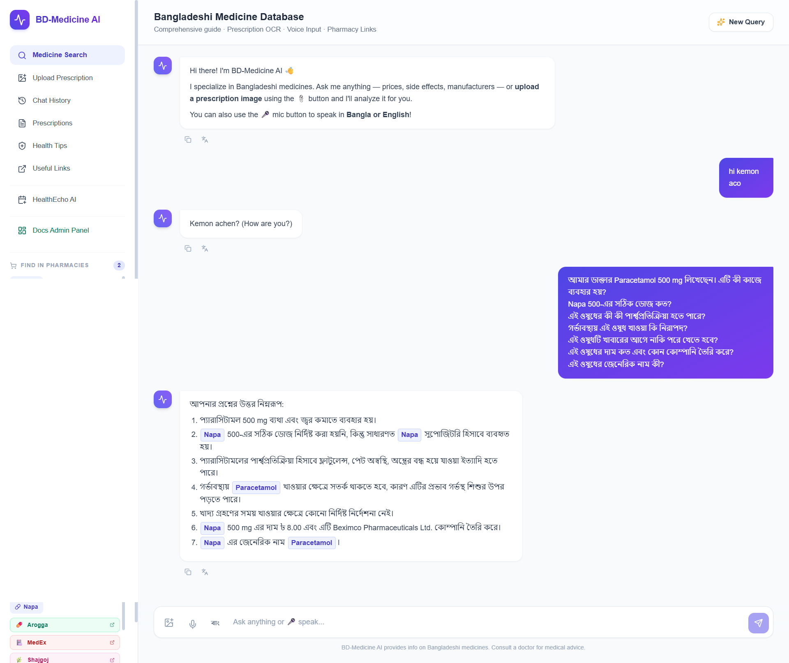

# BD Medicine AI

**BD Medicine AI** is an AI-powered emergency healthcare assistant designed to improve access to reliable pharmaceutical information during disasters. It combines a hybrid RAG-powered medicine database with an interactive emergency shelter directory to support patients, caregivers, volunteers, and frontline responders when timely information matters most.

---



## Problem Statement

During earthquakes, floods, cyclones, and other disasters, access to reliable healthcare information becomes difficult as medical services are disrupted and healthcare professionals are overwhelmed. Patients may only have a handwritten prescription or the name of a medicine but lack information about its dosage, generic alternatives, side effects, or precautions.

At the same time, people often struggle to locate nearby emergency shelters or obtain verified shelter information quickly. Existing information is scattered across multiple platforms, making it difficult for patients, caregivers, volunteers, and frontline responders to make timely decisions.

A single platform that provides trusted pharmaceutical guidance alongside accessible emergency shelter information can significantly improve emergency preparedness and response during crisis situations.

---

## Solution

BD Medicine AI uses a hybrid Retrieval-Augmented Generation (RAG) framework with a localized knowledge base containing over **21,000 Bangladeshi medicines** to answer questions about:

- Medicine usage, dosage, and precautions
- Generic alternatives and brand names
- Indications and side effects
- Prescription image (OCR) analysis

Users can search by medicine name or ask questions in natural language to receive fast, context-aware responses.

In addition, the platform includes an **interactive Bangladesh district map** and a **searchable emergency shelter directory** built from official government data. Users can explore districts, search for shelters, and view details in both map and table formats — making verified shelter information easier to access during emergencies.

While the shelter directory is currently a standalone searchable resource and is not yet integrated with the AI assistant, it complements the healthcare features by providing essential disaster-response information in a single platform.

Together, these features help patients, caregivers, volunteers, and emergency responders make informed decisions when timely access to information matters most.

---

## Core Features

### Medicine AI Assistant

- **RAG-powered Q&A**: Hybrid SQL + vector search over 21,000+ BD medicines
- **Prescription OCR**: Upload handwritten prescriptions for instant AI analysis (Groq Llama 4 Scout vision model)
- **Natural language queries**: Ask questions about any medicine by name or description
- **Generic alternatives**: Find affordable substitutes for brand-name medicines
- **Side effects and precautions**: Context-aware safety information

### Emergency Shelter Map

- **Interactive district map** of Bangladesh (MapLibre GL)
- **Shelter markers** color-coded by type:
  - Cyclone Shelters (red)
  - Flood Shelters (blue)
  - Disaster / Mujib Killa shelters (orange)
- **Filter and search**: Filter by shelter type; full-text search by name, district, upazila, contact person, or constructor
- **Paginated table view** with live map marker sync
- **Shelter details popup** with contact and capacity information
- Data sourced from `frontend/public/data/shelter.json` (official government records)

---


## Project Structure

```
BD Medicine AI/
├── backend/
│   ├── main.py               # FastAPI server with streaming responses
│   ├── rag.py                # RAG pipeline + prescription OCR
│   ├── database.py           # PostgreSQL + ChromaDB hybrid layer
│   ├── vector_db.py          # ChromaDB semantic search
│   ├── embeddings.py         # SentenceTransformers embeddings
│   └── requirements.txt
├── frontend/
│   ├── src/
│   │   ├── Chat.jsx          # Medicine chatbot interface
│   │   ├── DistrictMap.jsx   # Interactive emergency shelter map
│   │   ├── api.js            # API client
│   │   └── index.css         # Global styles
│   └── public/
│       └── data/
│           ├── bd_adm2.json  # Bangladesh district GeoJSON
│           └── shelter.json  # Emergency shelter dataset
└── README.md
```

---

## Tech Stack

| Layer | Technology |
|-------|-----------|
| Frontend | React 18, Vite, MapLibre GL |
| Backend | FastAPI (Python) |
| AI / LLM | Groq (Llama 4 Scout), all-MiniLM-L6-v2 embeddings |
| Database | PostgreSQL + ChromaDB (hybrid search) |
| OCR | Groq vision model (handwritten prescription extraction) |
| Image Storage | Cloudinary |
| Map | MapLibre GL v6 with Bangladesh district GeoJSON |

---

## Local Setup

### Backend

```bash
cd backend
pip install -r requirements.txt
uvicorn main:app --reload
```

### Frontend

```bash
cd frontend
npm install
npm run dev
```

---

## API Overview

| Endpoint | Method | Description |
|----------|--------|-------------|
| `/chat` | POST | Send a medicine query, receive AI-generated response |
| `/ocr` | POST | Upload prescription image for medicine extraction |
| `/medicines/search` | GET | Search the medicine database by name or keyword |
| `/health` | GET | Health check |

---

## Medicine Database

- **21,000+ medicines** indexed from Bangladeshi sources
- Fields: generic name, brand name, manufacturer, dosage form, strength, indications, side effects, precautions, local pricing (BDT)
- Embedded using `all-MiniLM-L6-v2` for semantic similarity search
- Hybrid retrieval: keyword (SQL ILIKE) + vector (ChromaDB cosine similarity)

---

## Shelter Data

The shelter dataset (`shelter.json`) is sourced from official government records and includes:

| Field | Description |
|-------|-------------|
| `name` | Shelter name |
| `shelter_type_id` | Type: Cyclone, Flood, or disaster variant |
| `district_name` | District |
| `upazila_name` | Upazila |
| `contact_person` | Responsible contact |
| `constructed_by` | Constructing authority |
| `capacity` | Capacity (where available) |
| `lat` / `lng` | Coordinates for map marker placement |

> **Note**: The shelter directory is currently a standalone searchable resource and is not yet integrated with the AI assistant. Integration is planned for a future release.

---

## Target Users

| User | Scenario |
|------|---------|
| Patients | Look up medicine info from a prescription during a disaster when pharmacies or doctors are unreachable |
| Caregivers | Find generic alternatives or check dosage for a family member |
| Volunteers | Quickly locate verified nearby emergency shelters |
| Frontline responders | Access medicine guidance and shelter data from a single platform |

---

## Recent Features

### Shelter Info Integration (District Map)

- `frontend/src/DistrictMap.jsx` updated with full shelter marker support
- Color-coded shelter types, type filter, full-text search, paginated table, and popup details
- Shelter data driven by `frontend/public/data/shelter.json`

---

## Team

| Name | Role |
|------|------|
| **Nazmus Sakib Apurba** Team Manager| ML-AI / Backend |
| **Shahidul Alam** | Backend |
| **Rifah Noshin Siddiqua** | Frontend |

---

## Changelog

### [0.9.0] - 2026-07-30

#### Added
- Emergency shelter directory with interactive district map
- Shelter markers color-coded by disaster type (Cyclone, Flood, Disaster)
- Shelter filter, full-text search, and paginated table view
- Disaster-focused project framing and updated documentation

### [0.8.0] - 2026-07-01

#### Added
- RAG pipeline with hybrid SQL + vector search
- Prescription OCR using Groq vision model
- Medicine chatbot with streaming responses
- Cloudinary integration for prescription image storage

### [0.5.0] - 2026-05-07

#### Added
- Initial medicine chatbot
- Database integration
- OCR pipeline

### [0.1.0] - 2026-05-05

#### Added
- Project initialization
- Basic setup and development environment

---

## License

This project is developed for disaster emergency response and humanitarian use in Bangladesh.

> Built with care by the BD Medicine AI team.
