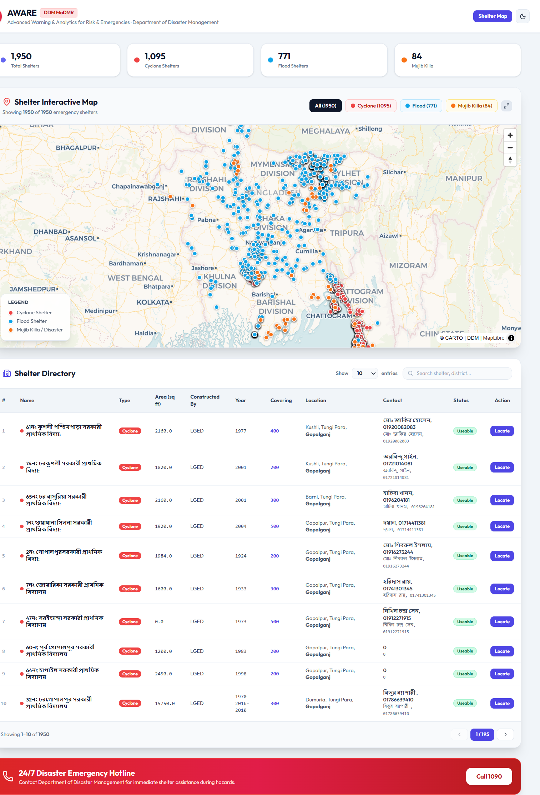
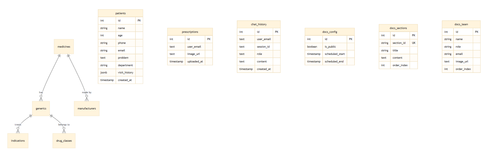
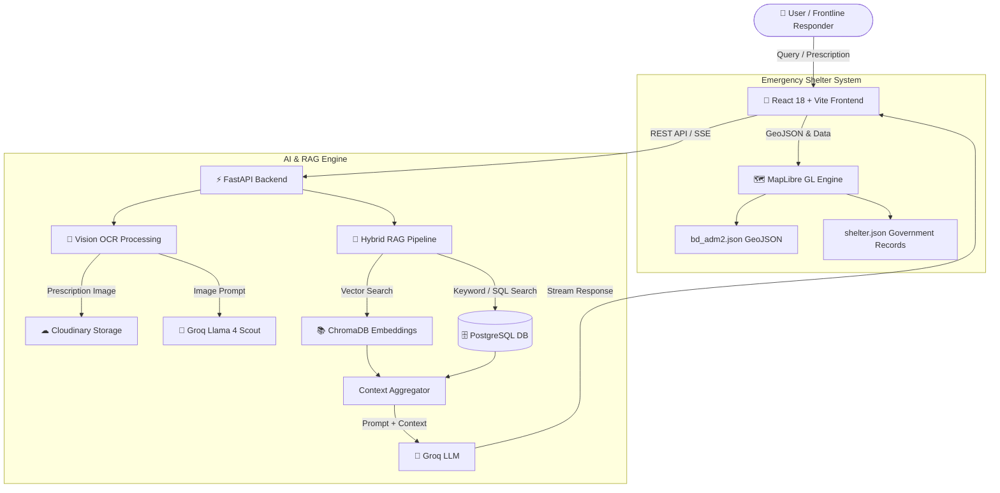

<h1 align="center">
🚑 BD Medicine AI
</h1>

<p align="center">
<b>AI-Powered Emergency Medicine & Shelter Assistant for Bangladesh</b>
</p>

<p align="center">
Hybrid RAG • 21,000+ Medicines • Prescription OCR • Emergency Shelter Finder • FastAPI • React
</p>

<p align="center">


</p>

---

## 📸 Application Preview

<p align="center">
  
</p>

---

# 📑 Table of Contents

- [💡 Problem Statement](#-problem-statement)
- [🚀 Solution](#-solution)
- [✨ Key Features](#-key-features)
- [📊 Project Statistics](#-project-statistics)
- [📸 Screenshots](#-screenshots)
- [🛠 Tech Stack](#-tech-stack)
- [🏗 Architecture & Workflow](#-architecture--workflow)
- [📁 Project Structure](#-project-structure)
- [⚡ Quick Start](#-quick-start)
- [🌐 API Documentation](#-api-documentation)
- [🗄 Medicine Database](#-medicine-database)
- [🗺 Shelter Directory](#-shelter-directory)
- [👥 Target Users](#-target-users)
- [👥 Team](#-team)
- [📋 Recent Features](#-recent-features)
- [📜 Changelog](#-changelog)
- [📄 License](#-license)

---

## 💡 Problem Statement

During earthquakes, floods, cyclones, and other natural disasters in Bangladesh, access to reliable healthcare information becomes severely limited as medical services are disrupted and healthcare professionals are overwhelmed. Patients often have only a handwritten prescription or a brand name of a medicine but lack information regarding its dosage, generic alternatives, side effects, or necessary precautions.

Concurrently, affected individuals struggle to locate nearby emergency shelters or obtain verified shelter data quickly. Essential emergency information is frequently fragmented across multiple platforms, complicating decision-making for patients, caregivers, volunteers, and frontline responders.

A single unified platform offering trusted pharmaceutical guidance alongside accessible emergency shelter details substantially enhances disaster response and emergency preparedness.

---

## 🚀 Solution

**BD Medicine AI** implements a hybrid Retrieval-Augmented Generation (RAG) framework backed by a comprehensive localized knowledge base containing over **21,000 Bangladeshi medicines**. The platform answers questions regarding:

- 💊 **Usage, dosage, & precautions**
- 🔄 **Generic alternatives & brand substitutes**
- ⚠️ **Indications & side effects**
- 📄 **Prescription image (OCR) analysis**

Users can search by medicine brand name or query in natural language for context-aware responses.

Additionally, the platform incorporates an **interactive Bangladesh district map** and a **searchable emergency shelter directory** derived from official government records. Users can explore all 64 districts, search shelters by location or contact details, and view information in synchronized map and table formats.

---

## ✨ Key Features

| 🚀 Feature | Description |
| :--- | :--- |
| 🤖 **AI Medicine Chat** | Ask complex medicine questions in natural language with hybrid RAG Q&A |
| 📄 **Prescription OCR** | Upload handwritten prescriptions for instant Vision AI analysis (Groq Llama 4 Scout) |
| 💊 **21,000+ Medicines** | Localized Bangladeshi pharmaceutical database with BDT pricing and generic substitutes |
| 🔍 **Hybrid RAG** | SQL keyword matching combined with ChromaDB vector semantic search |
| 🗺 **Shelter Map & Finder** | Interactive MapLibre GL map of Bangladesh with color-coded emergency shelters |
| 🎤 **Voice & Natural Search** | Multi-modal entry points supporting natural interaction |
| 🌐 **Bengali & English Support** | Dual-language capability for emergency accessibility |

---

## 📊 Project Statistics

<p align="center">
  <b>💊 21,000+</b> Medicines Indexed &nbsp;•&nbsp; 
  <b>🗺 64</b> Districts Covered &nbsp;•&nbsp; 
  <b>🏠 1,000s</b> Emergency Shelters &nbsp;•&nbsp; 
  <b>🧠 Hybrid</b> RAG Pipeline &nbsp;•&nbsp; 
  <b>⚡ Fast</b> Streaming AI
</p>

---

## 📸 Screenshots

### 💊 AI Medicine Assistant
<p align="center">
  
</p>

---

### 🗺 Emergency Shelter Finder
<p align="center">
  
</p>

---

### 📊 System Interface & Search
<p align="center">
  
</p>

---

## 🛠 Tech Stack

| Layer | Technology | Purpose |
| :--- | :--- | :--- |
| 🎨 **Frontend** | React 18, Vite | Interactive User Interface & State Management |
| ⚙ **Backend** | FastAPI (Python 3.11) | Asynchronous REST APIs & Streaming Responses |
| 🧠 **AI / LLM** | Groq (Llama 4 Scout) | Natural Language Generation & Prescription Vision OCR |
| 🔍 **Retrieval** | LangChain + ChromaDB | Hybrid Semantic Vector Search (`all-MiniLM-L6-v2`) |
| 🗄 **Database** | PostgreSQL | Structured Bangladeshi Medicine & Dosage Knowledge Base |
| ☁ **Storage** | Cloudinary | Secure Storage for Uploaded Prescription Images |
| 🗺 **Maps** | MapLibre GL v6 | Bangladesh District GeoJSON & Interactive Shelter Visualization |

---

## 🏗 Architecture & Workflow

### 🔄 Project Workflow

```
👤 User / Frontline Responder
       │
       ▼
📱 React Frontend (Vite)
       │
       ▼
⚡ FastAPI Backend
       │
       ▼
🧠 Hybrid RAG Pipeline
       │
   ├───┴────────────────────────┐
   ▼                            ▼
📚 ChromaDB (Vector Search)   🗄 PostgreSQL (SQL Query)
   │                            │
   └───┬────────────────────────┘
       │
       ▼
🤖 Groq LLM (Llama 4)
       │
       ▼
✅ Streaming AI Response
```

### 🧩 Detailed System Architecture



---

## 📁 Project Structure

```
📂 BD Medicine AI/
 ├── 📂 backend/
 │    ├── 🐍 main.py               # FastAPI server with streaming responses
 │    ├── 🤖 rag.py                # RAG pipeline + prescription OCR
 │    ├── 🗄 database.py           # PostgreSQL + ChromaDB hybrid layer
 │    ├── 🔍 vector_db.py          # ChromaDB semantic search
 │    ├── 🧬 embeddings.py         # SentenceTransformers embeddings
 │    └── 📜 requirements.txt
 ├── 📂 frontend/
 │    ├── 📂 src/
 │    │    ├── 💬 Chat.jsx          # Medicine chatbot interface
 │    │    ├── 🗺 DistrictMap.jsx   # Interactive emergency shelter map
 │    │    ├── 🔌 api.js            # API client
 │    │    └── 🎨 index.css         # Global styles
 │    └── 📂 public/
 │         └── 📂 data/
 │              ├── 🗺 bd_adm2.json  # Bangladesh district GeoJSON
 │              └── 🏠 shelter.json  # Emergency shelter dataset
 └── 📄 README.md
```

---

## ⚡ Quick Start

### 1️⃣ Clone the Repository

```bash
git clone https://github.com/Apurba3036/BD-MEDICINE-RAG-APP.git
cd "BD Medicine AI"
```

### 2️⃣ Backend Setup

```bash
cd backend
pip install -r requirements.txt
uvicorn main:app --reload
```

### 3️⃣ Frontend Setup

```bash
cd frontend
npm install
npm run dev
```

---

## 🌐 API Documentation

| Endpoint | Method | Purpose |
| :--- | :---: | :--- |
| `/chat` | `POST` | Send medicine query & receive streaming AI response |
| `/ocr` | `POST` | Upload prescription image for medicine extraction |
| `/medicines/search` | `GET` | Search medicine database by name or keyword |
| `/health` | `GET` | System health check endpoint |

---

## 🗄 Medicine Database

- **21,000+ medicines** indexed from authoritative Bangladeshi pharmaceutical sources.
- **Detailed Schema Fields**: Generic name, brand name, manufacturer, dosage form, strength, indications, side effects, precautions, and local BDT pricing.
- **Embedding Model**: `all-MiniLM-L6-v2` for high-dimensional semantic similarity.
- **Hybrid Retrieval Strategy**: Keyword search (`SQL ILIKE`) combined with vector similarity (`ChromaDB Cosine Similarity`).

---

## 🗺 Shelter Directory

The shelter dataset (`shelter.json`) is sourced from official government records:

| Field | Description |
| :--- | :--- |
| `name` | Shelter facility name |
| `shelter_type_id` | Type: Cyclone, Flood, or Disaster variant |
| `district_name` | District |
| `upazila_name` | Upazila |
| `contact_person` | Responsible contact official |
| `constructed_by` | Constructing authority |
| `capacity` | Shelter capacity |
| `lat` / `lng` | Geographic coordinates for map marker placement |

> **Note**: The shelter directory is currently a standalone searchable resource complementing healthcare tools. Deep AI chat integration for shelter queries is planned for a future release.

---

## 👥 Target Users

| User Category | Emergency Scenario |
| :--- | :--- |
| **Patients** | Retrieve critical medicine information and generic substitutes during disasters when clinics or pharmacies are unreachable. |
| **Caregivers** | Verify dosage, precautions, or side effects for family members in emergency shelters. |
| **Volunteers** | Quickly locate verified nearby emergency shelters and contact details. |
| **Frontline Responders** | Access pharmaceutical guidance and emergency shelter data from a single unified platform. |

---

## 👥 Team

| Member | Role | Focus |
| :--- | :--- | :--- |
| **Nazmus Sakib Apurba** | Team Lead / ML-AI | Hybrid RAG, System Architecture & LLM Integration |
| **Shahidul Alam** | Backend Engineer | API Layer, Database Design & OCR Pipeline |
| **Rifah Noshin Siddiqua** | Frontend Developer | UI/UX Design, MapLibre GL Integration & Chat Component |

---

## 📋 Recent Features

### Shelter Info Integration (District Map)

- `frontend/src/DistrictMap.jsx` updated with full shelter marker support.
- Color-coded shelter types (Cyclone = Red, Flood = Blue, Disaster = Orange).
- Type filter, full-text search across all fields, paginated data table, and interactive detail popups.
- Live synchronization between tabular view and map markers.

---

## 📜 Changelog

### [0.9.0] - 2026-07-30
#### Added
- Emergency shelter directory with interactive district map
- Shelter markers color-coded by disaster type (Cyclone, Flood, Disaster)
- Shelter filter, full-text search, and paginated table view
- Disaster-focused project framing and updated documentation

### [0.8.0] - 2026-07-01
#### Added
- RAG pipeline with hybrid SQL + vector search
- Prescription OCR using Groq vision model
- Medicine chatbot with streaming responses
- Cloudinary integration for prescription image storage

### [0.5.0] - 2026-05-07
#### Added
- Initial medicine chatbot
- Database integration
- OCR pipeline

### [0.1.0] - 2026-05-05
#### Added
- Project initialization
- Basic setup and development environment

---

## 📄 License

This project is developed for disaster emergency response and humanitarian use in Bangladesh. Released under the [MIT License](LICENSE).

---

<p align="center">
Made with ❤️ for <b>July Hackathon 2026</b><br/>
<i>AI for Disaster Response • Bangladesh 🇧🇩</i>
</p>
